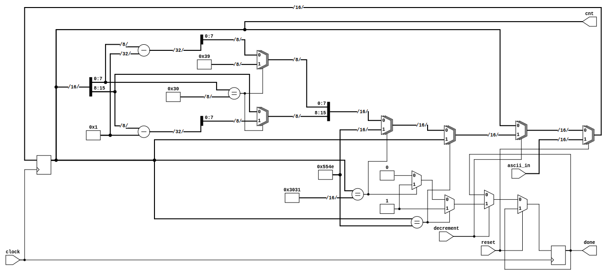

# Digital Computers 1



## Table of Contents

1. [Description](#Description)
2. [Requirements](#Requirements)
3. [Usage](#Usage)

<a name="Description"></a>
## 1. Description

This project aims to provide a fully open-source alternative to the
[Open CourseWare Laboratories](https://ocw.cs.pub.ro/courses/cn1) taught at
[Politehnica University of Bucharest](upb.ro).


<a name="Requirements"></a>
## 2. Requirements

This project uses [Icarus Verilog](http://iverilog.icarus.com/) for compiling
and simulation. Do note that it was tested only on a Linux platform with
[Make](https://www.gnu.org/software/make/) support. Viewing waveforms can be
done with any program that reads `.vcd` files.

If you would also like to synthesize some of the codes, the only tool I found
was [Yosys](http://www.clifford.at/yosys/). For rendering the generated
schematics you'll need [xdot](https://github.com/jrfonseca/xdot.py) for the
`.dot` files. An alternative is to render the `.json` connection description
with [netlistsvg](https://github.com/nturley/netlistsvg). I recommend you use
the [netlistsvg demo](https://neilturley.dev/netlistsvg/) online without
installing it. (Note: The first example picture in this README was produced by
netlistsvg.)

If you are using a Debian-based system, run the following command to install
the mentioned packages:

```bash
# for building and simulation + waveform viewing
sudo apt install make iverilog gtkwave

# for synthesis
# note: depends on xdot
sudo apt install yosys
```

<a name="Usage"></a>
## Usage

Open the directory corresponding to the laboratory you want to test. Run
`make build` for compiling, `make run` for simulation, and `gtkwave waves.vcd`
for viewing the resulting waveforms.

Some laboratories, like `lab-05`, include a synthesis script. If you run
`make synthesis` in the respective folder, both a `.dot` and `.json` file will
be generated both containing a logic gate schematic circuit based on the
Verilog code. The `.dot` is opened and rendered by default when running the
script.
