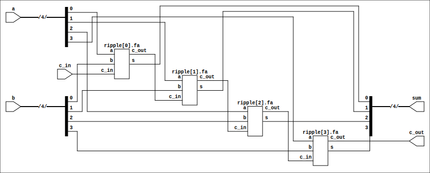
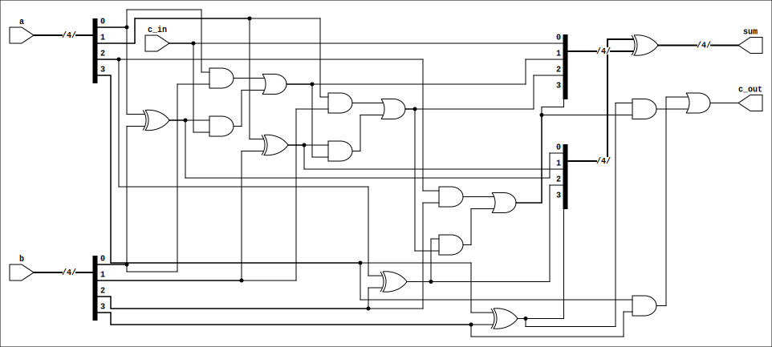
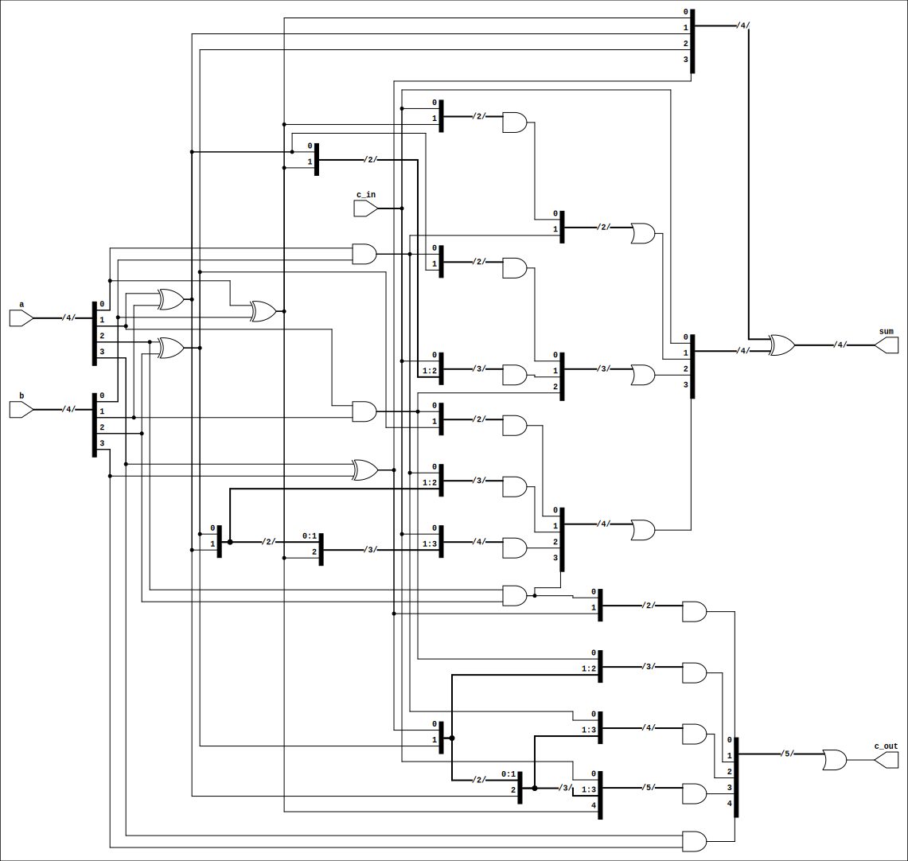

# Laboratory 7

Some of this code was borrowed from [Ștefan-Dan Ciocîrlan](https://github.com/sdcioc), mainly the test benches.

## Ripple-carry adder



## Carry-LookAhead

The following picture presents a inefficient implementation of this adder based
on the formulas:

```
G_i(A_i, B_i) = A_i and B_i
P_i(A_i, B_i) = A_i xor B_i
C_i+1 = G_i or P_i and C_i
```



The approximate time this adder takes is even longer than the ripple-carry one.

If we expand the `C_i` variable to a combination of `P`s and `G`s, we get a
faster implementation, as in the figure below, which has no more than number of bits gates on it's critical path.


