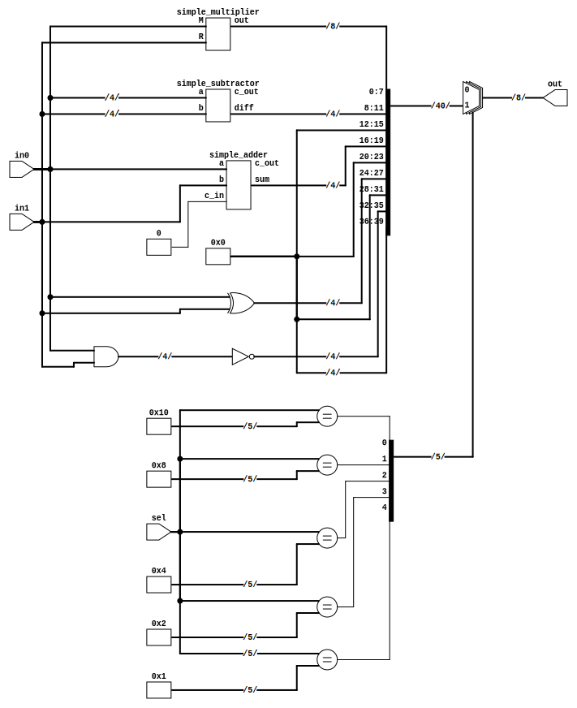
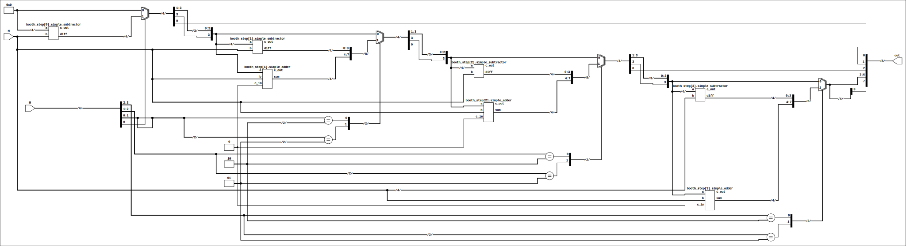
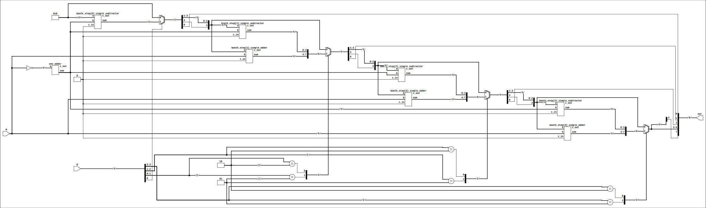

# Laboratory 8

In this laboratory we are interested in implementing an ALU, with the following
operations:

1. `NAND`
1. `XOR`
1. `ADD`
1. `SUB`
1. `MUL`

The adders/subtractors are implemented using carry-lookahead logic. All of them
are modeled using delays.

## Multiplication

Using the verilog operators `+` and `-` a sketch of Booth's algorithm is
implemented in the [multiplier_with_op](multiplier_with_op.v) module.

We can see that because it is implemented using combinational logic `O(NR_BITS)`
adders/subtractor are used. This means that our implemented adders have to
instantiated the same number times. To achieve this, I used a generate block and
tied the output of a stage to the input of the next one in the
[multiplier](multiplier.v) module.

I would also like to note that instead of using a subtractor the ALU responds on
average faster if we store the negative of the multiplicand and use it in
additions, instead of using subtractions. (This is only when also
taking into account the delay in the alu multiplexer.)

|Test|Delay using subtractions|Delay using -M|
|-|-|-|
|1.|10|10|
|2.|14|14|
|3.|10|10|
|4.|16|15|
|5.|10|10|
|6.|13|13|
|7.|10|10|
|8.|15|16|
|9.|17|14|

In order to precompute -M efficiently we must input `~M` to a
[one_adder](one_adder.v). It has at most two gates on it's critical path

The [multiplier2](multiplier2.v) module is implemented using this approach, but
the schematic is more complicated to understand.

