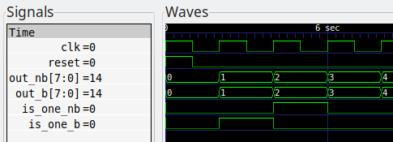

# Non-blocking vs. blocking assignments

In Verilog we think in maybe three different ways:

- Simulation thinking
- FPGA thinking
- ASIC thinking

The first mindset is based on event driven simulation. To dismiss any event
driven simulation confusion read this link [1].

The second and third ones must be discussed in parallel. When we think about
code that is going to be run on an FPGA or turned into a ASIC, what we are
conceptualizing is synthesizable code, that is code that could be turned into
hardware.

A ASIC is composed out of the logic gates, which are interconnected by the
netlist generated in the synthesis step of any HDL toolchain.

A FPGA is more complicated on the other hand, it is build out of Lookup Tables.
So, combinational logic is generally synthesized using flip-flops or latches and
the internal clock network.

It is generally now that one who seeks to understand what Verilog code means
learns about the difference between non-blocking and blocking assignments.

---

As I learned from this link [2], non-blocking assignments are the first step
Verilog developers took to solve *non-determinism*.

Why do you need to care? Because an excellent article published by Cummings [3]
shows us that running the same code in different conditions yields different
results. (I would like to note that
[MIT course 6.111](http://web.mit.edu/6.111/www/f2017/handouts/L04.pdf#page=30)
take very seriously the guidelines in the former article.)

Here are the guidelines in the article:

1. When modeling sequential logic, use non-blocking assignments.
2. When modeling latches, use non-blocking assignments.
3. When modeling combinational logic with an always block, use blocking
    assignments.
4. When modeling both sequential and “combinational” logic within the same
    always block, use non-blocking assignments.
5. Do not mix blocking and non-blocking assignments in the same always block.
6. Do not make assignments to the same variable from more than one always block.
7. Use $strobe to display values that have been assigned using non-blocking
    assignments.
8. Do not make assignments using #0 delays.

It you read the article or, any of the former links provided and their
references, you might have understood the theoretical difference between them.

---

## The Practical difference

In this folder I have setup a test module `counter` in which I have implemented
the described a hardware as in the following picture:


In [counter.v](counter.v) I have added two outputs:

- `out_nb`: the output for the non-blocking incrementation
- `out_b`: the output for the blocking incrementation

When running the code and reading the waveform we find no difference between
`out_nb` and `out_b`. Let's look at the debug output and compare them.



```
Active:   NB-OUT:   x, B-OUT:   x                    0
Postpone: NB-OUT:   0, B-OUT:   0                    0
------------------------------------------------------
Active:   NB-OUT:   0, B-OUT:   1                    2
Postpone: NB-OUT:   1, B-OUT:   1                    2
------------------------------------------------------
Active:   NB-OUT:   1, B-OUT:   2                    4
Postpone: NB-OUT:   2, B-OUT:   2                    4
...
```

On the left column we read in what region the code was executed. For showing a
output in the active event queue I used the `$display` directive. For showing a
output in the active event queue I used the `$strobe` directive. (See [4].) I
would like to remind the reader that the postponed queue is processed after
non-blocking assignment updates.

On the right most column we read the time. In between we have the values of the
output that was either assigned with a non-blocking assignment or with a
blocking one.

So we see that the waveform displays only the value after the simulator passed
through all the regions. We know that regardless if we are using `<=` or `=` we
can count that at the end of each time step the value will be the same, in this
example.

*If the values are in the end the same, what is the difference?* Check the
following two statements out. (Where buff_* is the internal register holding the
value corresponding to the respective output.)

```verilog
buff_is_one_nb <= (buff_out_nb == 8'd1);
buff_is_one_b  <= (buff_out_b == 8'd1);
```

But if you look in the anterior waveform, you see that `is_one_nb` and
`is_one_b` differ, the former "lagging" with one clock period. That is because
right hand statements, *or expressions in if statements*, are evaluated before
updates of left hand statements in non-blocking assignments.

This is why a code that was previously written using only `=`, which is a bad
practice, cannot be easily corrected to respect Cumming guidelines.


As we see in this schematic the circuits for `out_nb` and `out_b` are
symmetrical. But for `in_one_nb` has one extra D flip flop on it's path, than
`is_one_b`.

Sometimes Yosys replaces `=` in a `always @(posedge clk)` block with `<=`.

---

## Conclusions

Anyone who understood the difference can see that this was actually a article
about thinking in Verilog, rather that an unimportant programming quirk.


[1]: https://electronics.stackexchange.com/questions/202489/event-driven-simulation-confusion

[2]: https://insights.sigasi.com/opinion/jan/verilogs-major-flaw/

[3]: http://www.sunburst-design.com/papers/CummingsSNUG2000SJ_NBA.pdf

[4]: https://stackoverflow.com/questions/32832104/display-vs-strobe-vs-monitor-in-verilog
